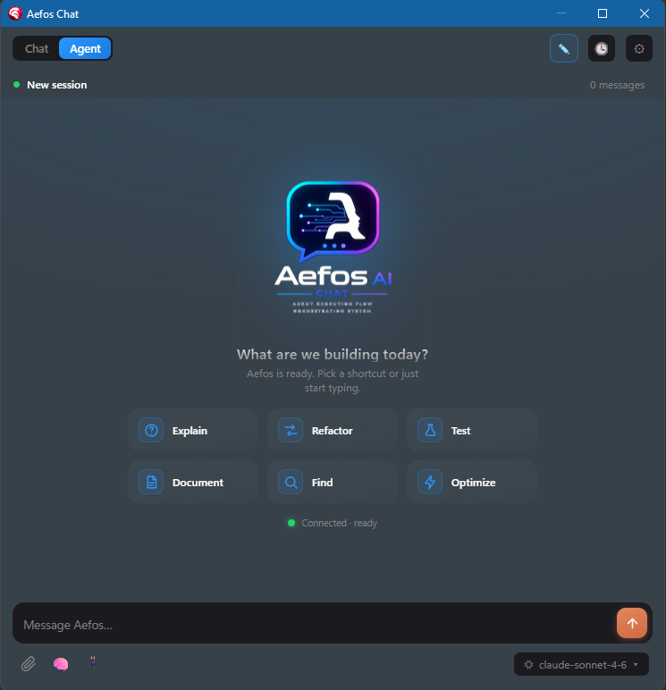

<!--
  MAINTAINER: set these before publishing
  - Replace https://moderndelphiworks.github.io/Aefos/ with the GitHub Pages / custom-domain URL (e.g. https://aefos.pubpascal.dev)
  - Replace <REPO_URL> with https://github.com/ModernDelphiWorks/Aefos
  - Releases link assumes this repo hosts the installer as a Release asset.
  This is the PUBLIC repo (downloads + manual + issues). The source code is private.
-->

# Aefos AI

**Your favorite AI coding CLI — living *inside* RAD Studio.**

***AEFOS** — **A**gent **E**xecution **F**low **O**rchestration **S**ystem.*

In-IDE AI **Chat** + **Terminal** for RAD Studio Delphi 13, powered by the AI CLI you
already use (Claude Code, Codex, GitHub Copilot CLI, Gemini).

[⬇️ Download](../../releases) · [📖 User Manual](https://moderndelphiworks.github.io/Aefos/) · [🐛 Report a bug](../../issues/new/choose) · [🔒 Security](SECURITY.md)

**English** · [Português (PT-BR)](README.pt-BR.md)

> **This is the public home of Aefos AI** — downloads, the user manual, and the issue
> tracker. The product source code is private; this repository hosts the things users
> need.

## What it is

Aefos AI brings the AI command-line tools you already use **into** RAD Studio Delphi
13, with deep awareness of your project. The agent doesn't just talk — it **acts** on
the open project: edits code, builds and runs (with the debugger), drives the Form
Designer, and more.

> **Bring your own CLI.** Aefos ships **no AI model and manages no credentials** — it
> is a thin, Delphi-aware harness on top of the CLI you already run.

## Features

- 💬 **In-IDE Chat** with an **Agent mode** that acts on your project (read/edit code,
  build/run, git, live Form Designer).
- 🖥️ **Docked Terminal** (real VTerm) with a command palette, profiles, and history.
- 🔀 **Multi-provider** — Claude Code, Codex, GitHub Copilot CLI, Gemini.
- ✅ **Inline diff** of every AI change, with accept/reject (Tab/Esc) — nothing is
  applied without your approval.
- 🎨 **Design ↔ Code** flow — add a component and watch the IDE flip to Design; add
  code and watch it flip to Code.

## Screenshots

| 💬 Chat (Agent mode) | 🖥️ Terminal |
|:---:|:---:|
|  |  |

## Documentation

📖 **[User Manual](https://moderndelphiworks.github.io/Aefos/)** (PT-BR / EN) — install, first steps, Chat, Terminal,
providers, configuration, licensing, and troubleshooting.

## Requirements

Before installing, make sure you have:

| Item | Requirement |
|------|-------------|
| **IDE** | RAD Studio **Delphi 13** (BDS 37.0) — Aefos is an IDE plugin, so the IDE must already be installed |
| **OS** | **Windows** |
| **AI CLI** | At least **one** AI coding CLI you already use: Claude Code, Codex, GitHub Copilot CLI, or Gemini. *Aefos brings no AI model — you bring your own CLI.* |
| **WebView2** | [Microsoft Edge WebView2 Runtime](https://aka.ms/webview2) — used for the rich Chat. **The installer provisions it automatically;** you don't need to install it yourself. |

## Install (step by step)

> 💡 First time? Just follow these five steps — it's a normal Windows installer,
> per-user, **no administrator rights needed**.

1. **Download** the latest installer from **[Releases](../../releases)** —
   the file is named `Aefos-Setup-<version>.exe` (e.g. `Aefos-Setup-0.19.1.exe`).
   You can also grab the `.sha256` next to it to verify the download.
2. **Close RAD Studio completely.** The installer copies and registers the IDE
   packages, so the IDE must be closed (it will tell you if it's still open).
3. **Run `Aefos-Setup-<version>.exe`.** It installs per-user into
   `%LOCALAPPDATA%\Aefos` and, if the WebView2 Runtime is missing, installs it for you.
4. **Start RAD Studio** again.
5. Open the panels from the **View** menu: **View → Aefos AI (Chat)** and/or
   **View → Aefos AI (Terminal)**.

### Connect your AI CLI (first run)

The Chat talks to the AI CLI you already use. Point Aefos at it once:

1. **Tools → Options → Aefos → AI Chat** (this is editable right away — you don't even
   need a project open).
2. Pick your **Executor** (Claude Code / Codex / GitHub Copilot CLI / Gemini), set its
   **path** and **model**, and **log in** to that CLI if it asks.
3. Open **View → Aefos AI (Chat)** and start typing.

## License & activation

**The Community edition is free — no license key required.** Install it and use the
Chat (including **Agent mode**) right away. Community is free for **personal,
educational, and internal business use** — no per-seat fee, no user limit, no penalty.

**Pro / Enterprise** unlock the Terminal, MCP auto-setup, wizards, session history, and
advanced context. To activate a key:

1. Open **View → Aefos AI (Chat)** and click the **license item** at the top — it shows
   your current status (e.g. *License: Trial* or *License: active*).
2. Paste your **license key**.
3. Done — this binds **this copy of Delphi** to your seat. The status updates to
   *active*.

**How the license works:**
- **One key = one active Delphi** per machine/user (single-seat, node-locked).
- **Offline-safe:** after the first online validation it keeps working **offline**
  within a grace window.
- **No key?** A built-in **trial** lets you evaluate the Pro features.

## Updating, reinstalling & moving to another machine

This is the part people ask about most — read it before you uninstall.

| Situation | What to do | What happens to your license |
|-----------|------------|------------------------------|
| **Update to a new version** (same machine) | Close RAD Studio, run the new `Aefos-Setup-*.exe` **over** the old one | ✅ **Preserved** — you do **not** re-enter the key or deactivate |
| **Reinstall** (same machine) | Same as above — just run the installer again | ✅ **Preserved** (the activation is tied to this machine) |
| **Move to another machine** | **First deactivate** on the old one: **View → Aefos AI (Chat) → license item → Deactivate**. Then install on the new machine and activate the key there. | 🔁 The seat is **freed and re-used** on the new machine (self-transfer) |
| **Uninstall for good** | Use Windows **Settings → Apps** (or the uninstaller). If you plan to use the key elsewhere, **deactivate first** (above) | ⚠️ Uninstalling alone does **not** free the seat — **deactivate** to release it |

> ⚠️ **Key point:** a simple uninstall/reinstall on the **same** machine keeps your
> license. Only **moving to a different machine** needs a **Deactivate** first, so the
> single seat is free to activate elsewhere. (Community/Free needs none of this.)

Full walkthrough in the [User Manual](https://moderndelphiworks.github.io/Aefos/).

## Editions

| Edition | Price | For whom |
|---------|-------|----------|
| **Community** | **Free** | Personal, educational **and internal business** use — no per-seat fee, no penalty |
| **Pro** | Subscription | Terminal, MCP auto-setup, wizards, history, advanced context |
| **Enterprise** | Contract | Broad corporate use, support, governance |

## Reporting bugs & requests

- 🐛 **[Open an issue](../../issues/new/choose)** — please read the
  [Submission Terms](TERMS-ISSUES.md) first (short, important).
- 🔒 **Security vulnerability?** Do **not** open a public issue — follow
  [SECURITY.md](SECURITY.md).
- ❓ Questions / help: see [SUPPORT.md](SUPPORT.md).

## Supply-chain transparency (CRA-ready)

- 📦 **SBOM** — a machine-readable Software Bill of Materials (CycloneDX 1.5) is
  published under [`sbom/`](sbom/).
- 🔒 **Security disclosure policy** — [SECURITY.md](SECURITY.md).
- 📝 **Actively maintained** — see the [CHANGELOG](CHANGELOG.md).
- 📜 **Third-party licenses** — [THIRD-PARTY-NOTICES.txt](THIRD-PARTY-NOTICES.txt).

## Privacy & license

- 📄 [EULA](LICENSE) — proprietary; Community edition free (incl. internal business use).
- 🔐 [Privacy Policy](PRIVACY.md) ([PT-BR](PRIVACY.pt-BR.md)) — LGPD-aligned.

---

Distributed via <a href="https://www.pubpascal.dev">PubPascal</a> · © 2026 Aefos AI (TecSis Info)

