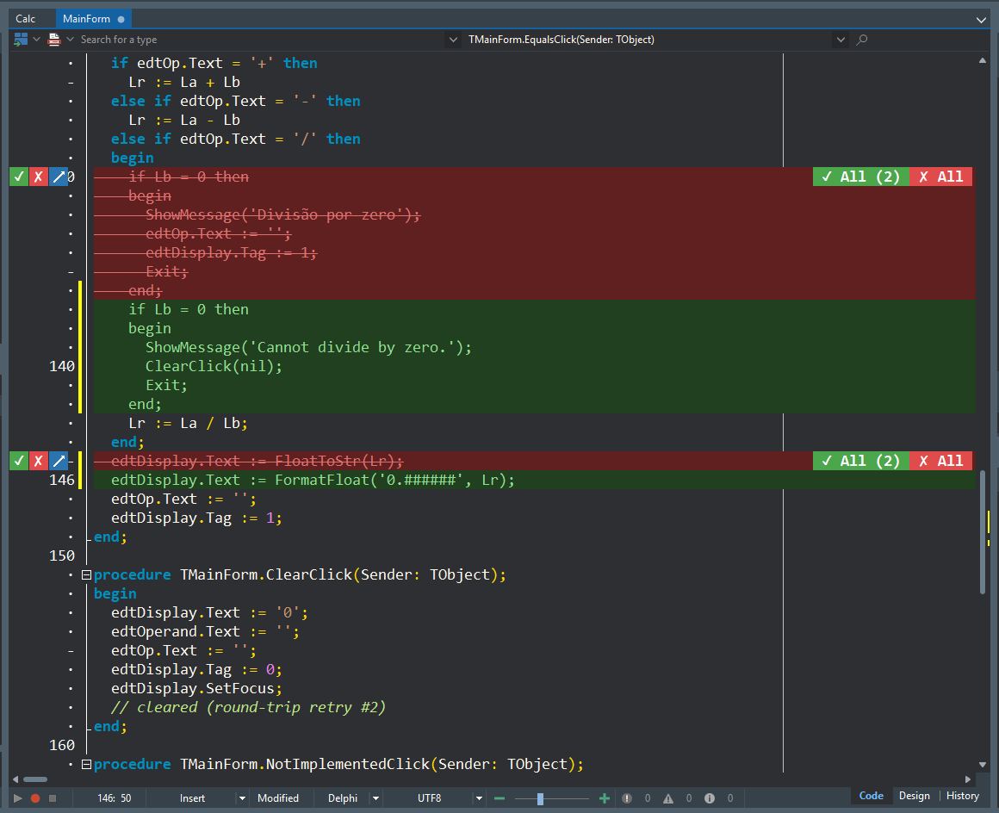

<!--
  MAINTAINER: set these before publishing
  - Replace https://moderndelphiworks.github.io/Aefos/ with the GitHub Pages / custom-domain URL (e.g. https://aefos.pubpascal.dev)
  - Replace <REPO_URL> with https://github.com/ModernDelphiWorks/Aefos
  - Releases link assumes this repo hosts the installer as a Release asset.
  This is the PUBLIC repo: source code, downloads, the manual and the issue tracker.
-->

# Aefos AI

**Your favorite AI coding CLI — living *inside* RAD Studio.**

***AEFOS** — **A**gent **E**xecution **F**low **O**rchestration **S**ystem.*

In-IDE AI **Chat** + **Terminal** for RAD Studio Delphi 13, powered by the AI CLI you
already use (Claude Code, Codex, GitHub Copilot CLI, Gemini).

[⬇️ Download](../../releases) · [📖 User Manual](https://moderndelphiworks.github.io/Aefos/) · [🐛 Report a bug](../../issues/new/choose) · [🔒 Security](SECURITY.md)

**English** · [Português (PT-BR)](README.pt-BR.md)

> **This is the public home of Aefos AI** — the source code, downloads, the user
> manual, and the issue tracker. Aefos AI is **free software under the GNU GPL v3**
> (since 5 August 2026).

## What it is

Aefos AI brings the AI command-line tools you already use **into** RAD Studio Delphi
13, with deep awareness of your project. The agent doesn't just talk — it **acts** on
the open project: edits code, builds and runs (with the debugger), drives the Form
Designer, and more.

> **Bring your own CLI.** Aefos ships **no AI model and manages no credentials** — it
> is a thin, Delphi-aware harness on top of the CLI you already run.

## Features

- 💬 **In-IDE Chat** with an **Agent mode** that acts on your project (read/edit code,
  build/run, git, live Form Designer).
- 🖥️ **Docked Terminal** (real VTerm) with a command palette, profiles, and history.
- 🔀 **Multi-provider** — Claude Code, Codex, GitHub Copilot CLI, Gemini.
- ✅ **Change review** — every AI edit shows as a **stacked before/after diff** (original
  struck out in red above the new lines in green) with per-change **accept / reject /
  annotate** controls in the gutter. Nothing is applied without your approval.
- 🎨 **Design ↔ Code** flow — add a component and watch the IDE flip to Design; add
  code and watch it flip to Code.

## Screenshots

| 💬 Chat (Agent mode) | 🖥️ Terminal |
|:---:|:---:|
|  |  |

**Change review** — see exactly what each AI edit changes, then accept, reject or
annotate it right in the editor gutter:

## Documentation

📖 **[User Manual](https://moderndelphiworks.github.io/Aefos/)** (PT-BR / EN) — install, first steps, Chat, Terminal,
providers, configuration, licensing, and troubleshooting.

## Requirements

Before installing, make sure you have:

| Item | Requirement |
|------|-------------|
| **IDE** | RAD Studio **Delphi 13** (BDS 37.0) — Aefos is an IDE plugin, so the IDE must already be installed |
| **OS** | **Windows** |
| **AI CLI** | At least **one** AI coding CLI you already use: Claude Code, Codex, GitHub Copilot CLI, or Gemini. *Aefos brings no AI model — you bring your own CLI.* |
| **WebView2** | [Microsoft Edge WebView2 Runtime](https://aka.ms/webview2) — used for the rich Chat. **The installer provisions it automatically;** you don't need to install it yourself. |

## Install (step by step)

> 💡 First time? Just follow these five steps — it's a normal Windows installer,
> per-user, **no administrator rights needed**.

1. **Download** the latest installer from **[Releases](../../releases)** —
   the file is named `Aefos-Setup-<version>.exe` (e.g. `Aefos-Setup-0.19.1.exe`).
   You can also grab the `.sha256` next to it to verify the download.
2. **Close RAD Studio completely.** The installer copies and registers the IDE
   packages, so the IDE must be closed (it will tell you if it's still open).
3. **Run `Aefos-Setup-<version>.exe`.** It installs per-user into
   `%LOCALAPPDATA%\Aefos` and, if the WebView2 Runtime is missing, installs it for you.
4. **Start RAD Studio** again.
5. Open the panels from the **View** menu: **View → Aefos AI (Chat)** and/or
   **View → Aefos AI (Terminal)**.

### Connect your AI CLI (first run)

The Chat talks to the AI CLI you already use. Point Aefos at it once:

1. **Tools → Options → Aefos → AI Chat** (this is editable right away — you don't even
   need a project open).
2. Pick your **Executor** (Claude Code / Codex / GitHub Copilot CLI / Gemini), set its
   **path** and **model**, and **log in** to that CLI if it asks.
3. Open **View → Aefos AI (Chat)** and start typing.

## License

**Aefos AI is free software under the [GNU GPL v3](LICENSE)** — all of it. There
is no key, no activation, no trial and no edition: every feature is in the build
you download, including the Terminal, the MCP server and the agent tools.

Two additional permissions are granted under GPLv3 section 7 (see
[`ADDITIONAL-PERMISSIONS.md`](ADDITIONAL-PERMISSIONS.md)): the code Aefos writes
for you is **yours**, under any licence you choose — using Aefos places no
obligation on what you build — and linking with the RAD Studio libraries a
design-time package cannot exist without is expressly allowed.

The licence that governed the software before 5 August 2026, when it was
proprietary, is kept for the record in [`EULA-historical.md`](EULA-historical.md).

## Updating, reinstalling & moving to another machine

Close RAD Studio and run the new `Aefos-Setup-*.exe` over the old one. That is the
whole procedure — for an update, a reinstall, or a move to a different machine.
Nothing is bound to a machine any more, so there is nothing to deactivate or
transfer.

Full walkthrough in the [User Manual](https://moderndelphiworks.github.io/Aefos/).

## Supporting the project

Aefos is free software and stays that way — there is no paid tier to upgrade to.
What keeps it moving is the AI subscriptions its own development runs on, and
those are paid by one person.

If Aefos saves you time, the **Sponsor** button at the top of this page is the way
to help. Companies: sponsorship is invoiceable, a personal payment link usually is
not.

## Reporting bugs & requests

- 🐛 **[Open an issue](../../issues/new/choose)** — please read the
  [Submission Terms](TERMS-ISSUES.md) first (short, important).
- 🔒 **Security vulnerability?** Do **not** open a public issue — follow
  [SECURITY.md](SECURITY.md).
- ❓ Questions / help: see [SUPPORT.md](SUPPORT.md).

## Supply-chain transparency (CRA-ready)

- 📦 **SBOM** — a machine-readable Software Bill of Materials (CycloneDX 1.5) is
  published under [`sbom/`](sbom/).
- 🔒 **Security disclosure policy** — [SECURITY.md](SECURITY.md).
- 📝 **Actively maintained** — see the [CHANGELOG](CHANGELOG.md).
- 📜 **Third-party licenses** — [THIRD-PARTY-NOTICES.txt](THIRD-PARTY-NOTICES.txt).

## Privacy & license

- 📜 [License](LICENSE) — GNU GPL v3, with [additional permissions](ADDITIONAL-PERMISSIONS.md).
- 🔐 [Privacy Policy](PRIVACY.md) ([PT-BR](PRIVACY.pt-BR.md)) — LGPD-aligned.

---

Distributed via <a href="https://www.pubpascal.dev">PubPascal</a> · © 2026 Aefos AI (TecSis Info)

