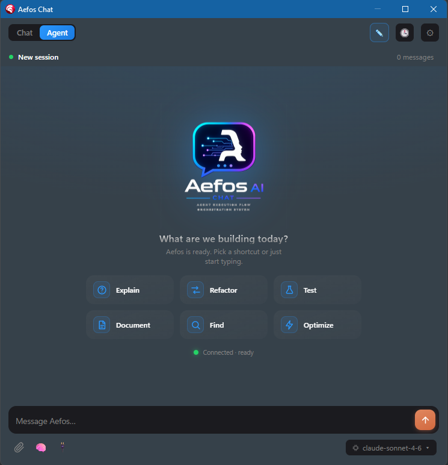
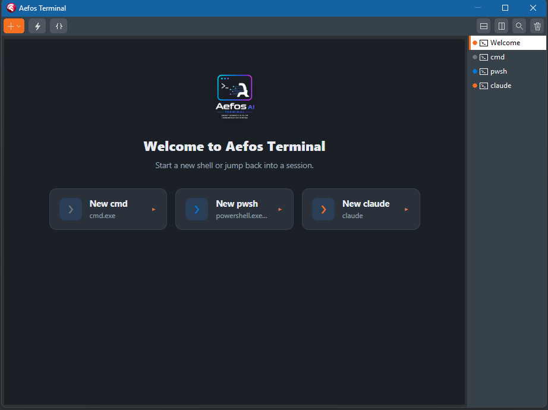

# Aefos AI

**Sua CLI de IA favorita — rodando *dentro* do RAD Studio.**

***AEFOS** — **A**gent **E**xecution **F**low **O**rchestration **S**ystem.*

**Chat** + **Terminal** de IA na IDE do RAD Studio — Delphi 13, 12 Athens e 11
Alexandria — movidos pela CLI de IA que você já usa (Claude Code, Codex,
GitHub Copilot CLI, Gemini).

[⬇️ Download](../../releases) · [📖 Manual do Usuário](https://moderndelphiworks.github.io/Aefos/) · [🐛 Reportar bug](../../issues/new/choose) · [🔒 Segurança](SECURITY.md) · [💙 Apoie o Aefos](https://link.mercadopago.com.br/aefosai)

[English](README.md) · **Português (PT-BR)**

> **Esta é a casa pública do Aefos AI** — o código-fonte, downloads, manual
> do usuário e abertura de issues. O Aefos AI é **software livre sob a GNU GPL
> v3** (desde 5 de agosto de 2026).

## O que é

O Aefos AI traz as ferramentas de IA de linha de comando que você já usa para
**dentro** do RAD Studio, com conhecimento profundo do seu projeto. O agente
não só conversa — ele **age** no projeto aberto: edita código, compila e roda (com
depurador), opera o Form Designer e mais.

> **Traga sua CLI.** O Aefos **não inclui modelo de IA nem gerencia credenciais** — é
> um harness fino, ciente de Delphi, sobre a CLI que você já roda.

## Recursos

- 💬 **Chat na IDE** com **modo Agent** que age no projeto (ler/editar código,
  build/run, git, Form Designer ao vivo).
- 🖥️ **Terminal docado** (VTerm de verdade) com paleta de comandos, perfis e histórico.
- 🔀 **Multi-provedor** — Claude Code, Codex, GitHub Copilot CLI, Gemini.
- ✅ **Diff inline** de cada alteração da IA, com aceitar/rejeitar (Tab/Esc) — nada é
  aplicado sem o seu aval.
- 🎨 Fluxo **Design ↔ Code** — adicione um componente e veja a IDE virar Design; adicione
  código e veja virar Code.

## Telas

| 💬 Chat (modo Agent) | 🖥️ Terminal |
|:---:|:---:|
|  |  |

## Documentação

📖 **[Manual do Usuário](https://moderndelphiworks.github.io/Aefos/)** (PT-BR / EN) — instalação, primeiros passos,
Chat, Terminal, provedores, configuração, licenciamento e solução de problemas.

## Download e instalação

1. Pegue o instalador mais recente em **[Releases](../../releases)**
   (`Aefos-Setup-<versão>.exe`).
2. Feche a RAD Studio, rode o instalador (por-usuário, sem admin).
3. Reinicie a RAD Studio — aparecem os menus **View → Aefos AI (Chat)** e
   **View → Aefos AI (Terminal)**.

Passos completos no [manual](https://moderndelphiworks.github.io/Aefos/).

## Requisitos

| Item | Requisito |
|------|-----------|
| IDE | RAD Studio **Delphi 13** (BDS 37.0), **Delphi 12 Athens** (BDS 23.0) ou **Delphi 11 Alexandria** (BDS 22.0) |
| SO | **Windows** |
| CLI de IA | Pelo menos uma: Claude Code / Codex / GitHub Copilot CLI / Gemini (traga a sua) |
| Markdown rico (opcional) | [Runtime do WebView2](https://aka.ms/webview2) |

## Licença

**O Aefos AI é software livre sob a [GNU GPL v3](LICENSE)** — todo ele. Não há
chave, ativação, período de teste nem edições: todo recurso está no build que
você baixa, incluindo o Terminal, o servidor MCP e as ferramentas do agente.

Duas permissões adicionais são concedidas pela seção 7 da GPLv3 (veja
[ADDITIONAL-PERMISSIONS.md](ADDITIONAL-PERMISSIONS.md)): o código que o Aefos
escreve para você é **seu**, sob qualquer licença — usar o Aefos não cria
obrigação nenhuma sobre o que você constrói — e a linkagem com as bibliotecas
do RAD Studio, sem as quais um pacote design-time não pode existir, é
expressamente permitida.

A licença que governava o software antes de 5 de agosto de 2026, quando ele era
proprietário, fica como registro em [EULA-historical.md](EULA-historical.md).

## Atualizar, reinstalar e mudar de máquina

Feche o RAD Studio e rode o novo `Aefos-Setup-*.exe` por cima do antigo. é todo o
procedimento — para atualizar, reinstalar ou mudar de máquina. Nada mais fica
preso a uma máquina, então não há o que desativar ou transferir.

Passo a passo completo no [Manual do Usuário](https://moderndelphiworks.github.io/Aefos/).

## ❤️ Apoie o Aefos

**O Aefos AI é software livre (GPL v3) — feito e mantido por um desenvolvedor só.**

### **[→ Doar / Apoiar o Aefos AI ←](https://link.mercadopago.com.br/aefosai)**

*Qualquer valor, qualquer forma de pagamento — você escolhe as duas. Cartão, Pix ou boleto.*

**Prefere Pix?** Chega inteiro ao projeto, sem taxa de processadora.

**Chave Pix (aleatória):** `4b155305-2671-4c39-8d58-7b9b5c428e18`

Se o Aefos poupa tempo seu ou do seu time, **considere doar.** Não há paywall
nem versão paga para onde migrar: todo recurso está no build que você baixa. O
que mantém o projeto vivo, funcionando a cada nova versão do RAD Studio e com o
roadmap andando são as doações e as assinaturas de IA que o próprio
desenvolvimento consome, pagas por uma pessoa só.

**Empresas:** usar o Aefos internamente não custa nada e não obriga a nada. Se
ele faz parte da sua toolchain, patrociná-lo é a forma mais barata de mantê-lo
de pé — e patrocínio é faturável, onde um link de pagamento pessoal em geral
não é: é só pedir que a gente resolve. Contribuição em código vale tanto
quanto dinheiro; veja [CONTRIBUTING.md](CONTRIBUTING.md).

---

## Reportar bugs e pedidos

- 🐛 **[Abrir uma issue](../../issues/new/choose)** — leia antes os
  [Termos de Submissão](TERMS-ISSUES.md) (curto e importante).
- 🔒 **Vulnerabilidade de segurança?** **Não** abra issue pública — siga o
  [SECURITY.md](SECURITY.md).
- ❓ Dúvidas / ajuda: veja o [SUPPORT.md](SUPPORT.md).

## Transparência de supply-chain (CRA-ready)

- 📦 **SBOM** — inventário legível por máquina (CycloneDX 1.5) em [`sbom/`](sbom/).
- 🔒 **Política de divulgação de vulnerabilidades** — [SECURITY.md](SECURITY.md).
- 📝 **Manutenção ativa** — veja o [CHANGELOG](CHANGELOG.md).
- 📜 **Licenças de terceiros** — [THIRD-PARTY-NOTICES.txt](THIRD-PARTY-NOTICES.txt).

## Privacidade e licença

- 📄 [GNU GPL v3](LICENSE) — software livre, com duas permissões adicionais
  da §7 ([ADDITIONAL-PERMISSIONS.md](ADDITIONAL-PERMISSIONS.md)): o código que o
  Aefos gera é **seu**, sob qualquer licença, e a linkagem com as bibliotecas do
  RAD Studio é expressamente permitida. A licença anterior fica como registro
  em [EULA-historical.md](EULA-historical.md).
- 🔐 [Política de Privacidade](PRIVACY.pt-BR.md) ([EN](PRIVACY.md)) — alinhada à LGPD.

---

Distribuído via <a href="https://www.pubpascal.dev">PubPascal</a> · © 2026 Aefos AI (TecSis Info)

