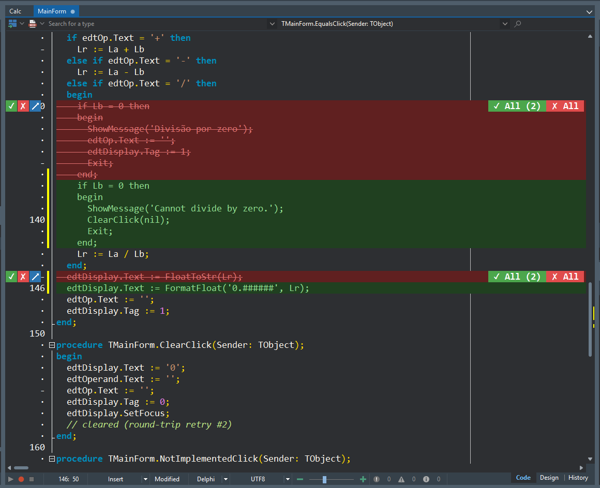

# 5. Usando o Chat

O painel de Chat é onde você conversa com a IA e a coloca para trabalhar no seu
projeto.

## Modo Agent vs. modo Chat

| Modo | O que faz | Quando usar |
|------|-----------|-------------|
| **Agent** (padrão) | A IA pode **agir** no projeto: ler, editar código, compilar, rodar, mexer no Form Designer, git… via ferramentas MCP | Quando você quer que a IA *faça* algo no projeto |
| **Chat** | Só conversa — sem agir no projeto | Tirar dúvidas, brainstorming, explicações |

O **modo Agent é o padrão**. Os dois modos são mantidos distintos — escolha conforme a
intenção.

## Mandando uma mensagem

Digite seu pedido e pressione **Enter**. A saída do CLI é transmitida ao vivo e
renderizada como **Markdown** (com destaque de sintaxe) quando o WebView2 está
instalado; sem ele, aparece como texto simples.

## Skills com `/agent`

Você pode invocar **skills** (fluxos pré-definidos) digitando `/agent` seguido da
skill. As skills ficam numa pasta canônica do projeto (`.aefos/skills/`) e são
replicadas automaticamente para o formato que o CLI ativo espera.

- Texto livre (sem skill) vai direto para o CLI como um prompt comum.
- Uma skill monta um prompt **ciente de Delphi** e despacha para o CLI.

## Contexto do projeto

No modo Agent, o Aefos empacota o **contexto do seu projeto Delphi** (via OTA) para
que a IA responda com conhecimento do que está aberto — em vez de respostas genéricas.

## Revisão de alterações: veja o antes e o depois

Sempre que o agente **altera código**, o Aefos mostra a mudança **dentro do editor**,
como um diff **antes/depois empilhado**: o texto original aparece em **vermelho riscado
em cima**, e o novo em **verde logo abaixo** — então você vê exatamente o que vai mudar
antes de decidir (funciona também para linhas largas e blocos de várias linhas).

Na **calha** (à esquerda), cada mudança tem três botões:

- **✓ aceitar** — mantém o novo texto.
- **✗ rejeitar** — desfaz e restaura o original.
- **✎ anotar** — escreve uma nota que é **entregue ao agente** (marcada como aceita ou
  rejeitada), para ele aprender o seu retorno sobre aquela edição.

Há ainda a pílula **Aceitar tudo / Rejeitar tudo** quando há várias mudanças pendentes —
elas se acumulam **sem travar** o agente. **Salvar** o arquivo (ou rodar) **aceita** as
mudanças pendentes e limpa a revisão.

> A revisão aparece para edições de código (ex.: editar uma unit, substituir trecho).
> Veja [O que o agente faz no seu projeto](06-o-que-o-agente-faz.md).

## Segurança: consentimento e auditoria

Ações que **modificam** o projeto passam por um pedido de **consentimento** antes de
rodar, e **toda** chamada de ferramenta fica registrada num **log de auditoria**.
Você tem rastreabilidade do que o agente fez.

➡️ Próximo: [O que o agente faz no seu projeto](06-o-que-o-agente-faz.md)
