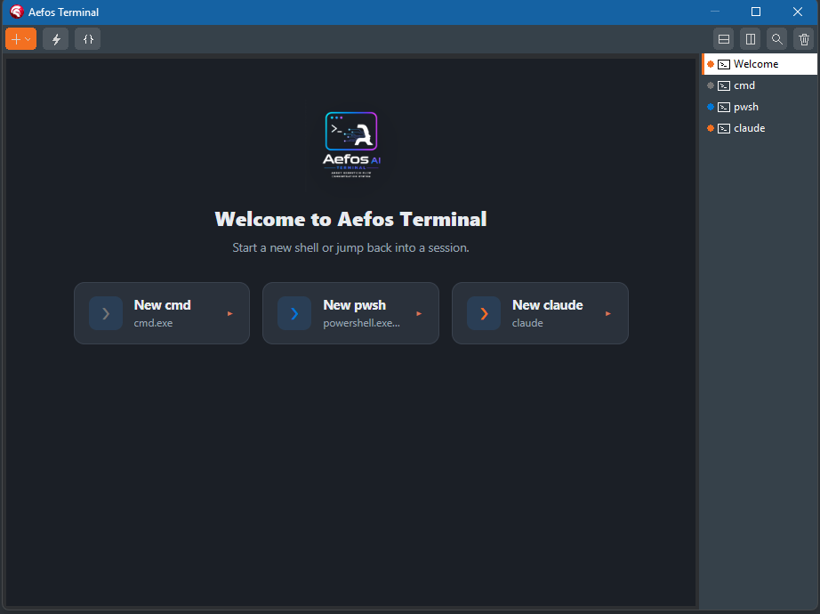

# 7. Using the Terminal

The Aefos **Terminal** is a real terminal docked inside the IDE (VTerm emulation),
with the same OTA reach as the Chat. You can run your AI CLI, shell commands, git —
all without switching windows.

> The Terminal is part of the **Pro** edition. See [Licensing & editions](10-licensing.md).

## Opening the Terminal

Go to **View → Aefos AI (Terminal)**. The terminal appears as a dockable IDE panel.

## Command palette (Ctrl+P)

Press **Ctrl+P** to open Aefos's **command palette** — your productivity hub in the
terminal:

- History by type
- Profiles
- Actions
- Snippets

> **Ctrl+P** is the **Aefos** palette. **Ctrl+R** is the shell's **native** reverse
> search (not Aefos) — the two coexist.

## Shell profiles

The Terminal supports **profiles** (for example PowerShell, cmd, etc.), with
configurable themes and fonts. Pick the shell you prefer for your workflow.

## History and snippets

- Navigable command **history**.
- Reusable **snippets** (with variables).
- Shell **reverse-search** to find commands again.

## Fonts and glyphs (Nerd Font)

The Terminal is ready for glyph fonts (powerline/Nerd Font). If you see "tofu" boxes
instead of prompt icons, it is a **font** issue — set the terminal font in the options
to a compatible family (e.g. a *Nerd Font*).

## Relationship to the Chat

Both the Chat and the Terminal use the same MCP engine underneath. An agent launched
**from the terminal** can also act on the project, with the same consent and audit
guarantees.

The **editor change review** (the before/after diff with accept / reject / annotate in the
gutter) is the same for both — when the terminal agent edits code, you review it exactly
like in the Chat. See
[Reviewing changes](05-using-the-chat.md#reviewing-changes-see-the-before-and-the-after).

➡️ Next: [AI providers](08-ai-providers.md)
